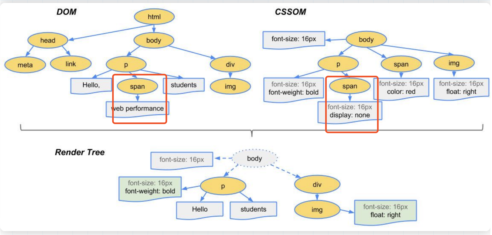
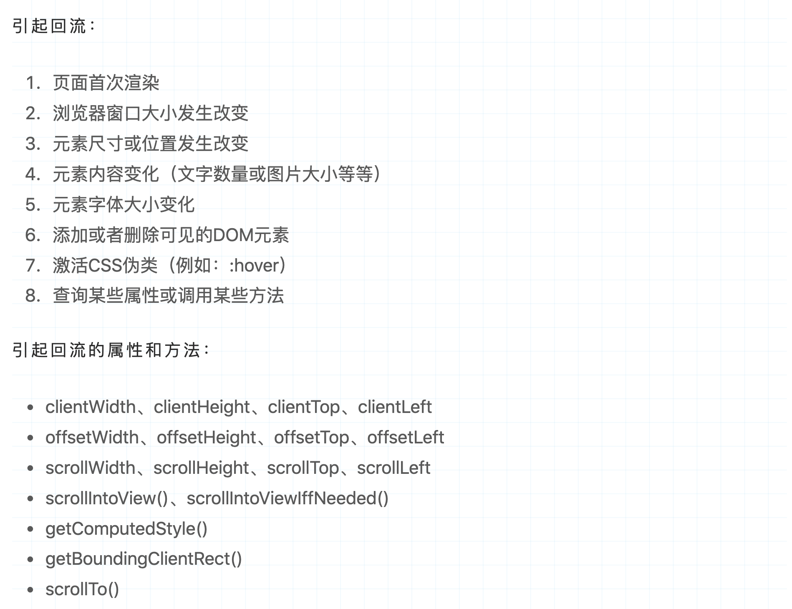
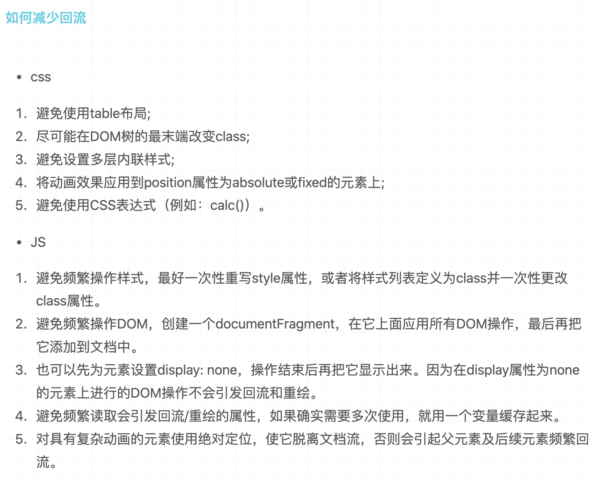
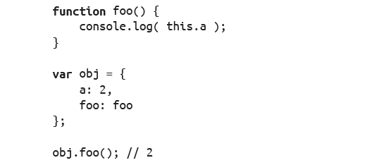
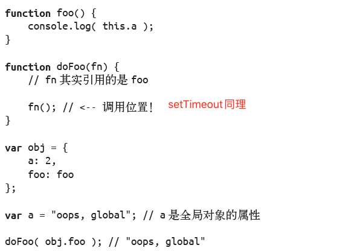
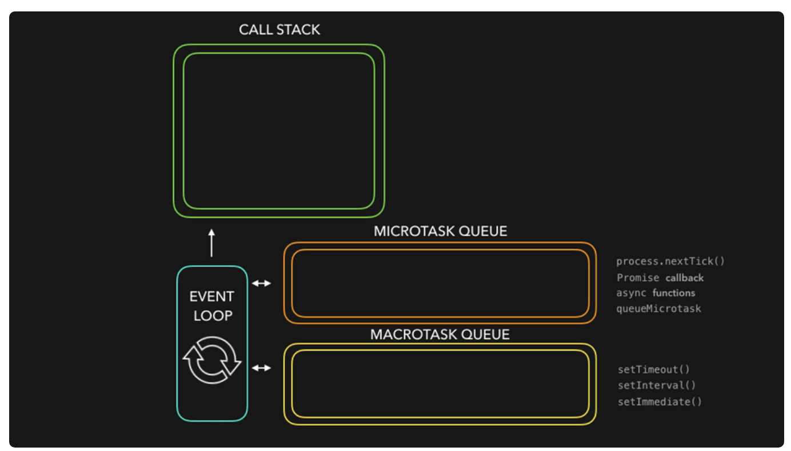

# 浏览器从输入url到页面呈现，涉及的一些流程？
> 浏览器知识   
[图解浏览器的基本工作原理](https://zhuanlan.zhihu.com/p/47407398)  
[从输入URL开始建立前端知识体系](https://juejin.cn/post/6935232082482298911#heading-0)

## 解析URL，发起请求，查看是否可以命中缓存  

### 强缓存
  - Expires：来自响应头；GMT格式；缺点：服务器、客户端时间可能不一致
  - Cache-Control：max-age，来源服务器、客户端；缺点：终会失效
  
### 协商缓存  
  - Last-Modified(响应头)，If-Modified-Since(请求头)
  - ETag(响应头)、If-None-Match(请求头)。 Etag优先  

### 资源存储位置
- Service Worker；
- Memory Cache；
- Disk Cache；
- Push Cache：最后生效，HTTP/2支持，存于会话Session，时效5min；

## DNS查询
- 递归查询：浏览器缓存->系统缓存->路由器缓存->ISP运营商缓存
- 迭代查询：局部的DNS服务器并不会自己向其他服务器进行查询，而是把能够解析该域名的服务器IP地址返回给客户端，客户端会不断的向这些服务器进行查询
- DNS负载均衡：网站会部署到多台服务器，DNS服务器根据不同服务器的负载，返回不同的域名解析(IP地址)，达到均衡负载的目的

## TCP三次握手
*	SYN=1(ISN), Seq=X    注：每个链接ISN不同，4ms加1
*	SYN=1, ACK=X+1, Seq=Y
*	ACK=Y+1

## TSL/SSL 过程 
*	Client Hello：协议版本、加密算法、压缩算法、随机数N1
*	ServerHello：选择的协议、加密算法、会话ID、随机数N2、CA证书、公钥
*	Finish：验证证书，发送公钥加密后的随机数N3和前面发送的所有内容的hash值，用来供服务器校验
*	Finish：随后的信息都将用双方商定的对话秘钥（session key）发送
对话秘钥 = 加密算法 + (N1 + N2 + N3)

## HTTP2基础概念
1. 帧（frame）和流（stream）：每个帧会标识出属于哪个流
2. 二进制传输
3. 多路复用
    - 同域名下所有通信都在单个连接上完成 
    - 单个连接上可以并行交错的请求和响应
4. 头压缩

## websock过么？

## 生成DOM树
字节 -> 字符 -> 令牌-> 节点-> 对象模型
*	转换：二级制 => HTML
*	令牌华：浏览器将字符串转换成 W3C HTML5 标准规定的各种令牌
*	词法分析：发出的令牌转换成定义其属性和规则的“对象”
*	DOM构建：由于 HTML 标记定义不同标记之间的关系，创建的对象链接在一个树数据结构内

## 生成CSS对象模型 - CSSOM
字节 -> 字符 -> 令牌-> 节点-> CSSOM

## 生成布局树 - Layout Tree
*	DOM 树与 CSSOM 树合并后形成渲染树；
*	渲染树只包含渲染网页所需的节点；
*	布局树(Layout Tree)和DOM树，哪些元素可见，哪些不可见？display:none、伪元素
*	布局计算每个对象的精确位置和大小；
*	最后一步是绘制，使用最终渲染树将像素渲染到屏幕上；

## 渲染
*	获取DOM后分割为多个图层
*	对每个图层的节点计算样式结果 （Recalculate style--样式重计算）
*	为每个节点生成图形和位置 （Layout--重排,回流）
*	将每个节点绘制填充到图层位图中 （Paint--重绘）
*	图层作为纹理上传至GPU
*	组合多个图层到页面上生成最终屏幕图像 （Composite Layers--图层重组）

## CSS加载会阻塞DOM树的解析吗？
*	不阻塞解析
*	阻塞DOM树渲染
*	阻塞后面JS语句的执行(防止重绘、回流)

## JS下载过程会阻塞渲染进程么？
*	JS文件没下载并解析完成之前，后续的 HTML 和 CSS 无法解析：
*	JS 文件的下载不会阻塞前面 HTML 和 CSS 的解析：

## 回流、重绘(见下图)：
### 回流必将引起重绘，而重绘不一定会引起回流
*	重绘：当页面中元素样式的改变并不影响它在文档流中的位置时（例如：color、background-color、visibility等；
*	回流：当Render Tree中部分或全部元素的尺寸、结构、或某些属性发生改变时，浏览器重新渲染部分或全部文档的过程称为回流



## 普通图层和复合图层：如何创建复合图层？ 
*	translate3d
*	translateZ
*	opacity属性/过渡动画
*	will-chang属性

## 项目怎么做的移动端适配？
*	flexible原理（1px问题，通过viewport）


# 基础题：

## 为什么 0.1 + 0.2 != 0.3 ？

通过“乘2取整，顺序排列”方法得到0.1、0.2的二进制数是无限循环的，根据IEEE754规范:
- S：表示符号位(1位)，0表示负数；1表示正数；
- E：表示指数位(11位)，对应值可正可负；
- M：有效数字(52+省略一位)，二进制表示有效数字总是1.xx…xx的形式，尾数部分f在规约形式下第一位默认为1（省略不写，xx..xx为尾数部分m，最长52位）

由于位数限制，需要将多余位截掉。`进制转换中就可能存在精度丢失`  
指数位数不相同，运算时需要`对阶运算，这部分也可能产生精度损失`    
综上：在进制转换中会产生精度丢失！！！  
`公式：n = (-1)^s * 2^e * m`

## Number 存储空间是多大？超出的部分怎么办？
*	Math.pow(2, 53)，53为有效数位数
*	超出部分会被截断

## new 一个构造函数发生了什么？
```
function myNew(Constructor, ...args) {
    let obj = {}; // 1. 创建实例对象
    obj.__proto__ = Constructor.prototype; // 2. 原型链继承
    const res = Constructor.apply(obj, args); // 3. 修改 this 指向实例
    if (/^(object|function)$/.test(typeof res)) return res; // 4. 构造函数返回的是对象就直接该返回该结果
    return obj; // 否则返回实例
}
```

## Symbol有什么用处？
*	对象的一些内部行为是定义在Symbol类型中的。修改它们可以影响对象功能，例如Symbol.hasInstance、`Symbol.iterator`、Symbol.unscopables、Symbol.toPrimitive、Symbol.toStringTag

## JS编译、执行要点？
### 编译阶段 
产生作用域、作用域链(词法作用域)。编译阶段中的一部分工作就是找到所有的声明，并用合适的作用域将它们关联起来
*	词法作用域：词法作用域意味着作用域是由书写代码时函数声明的位置来决定的。编译的词法分析阶段基本能够知道全部标识符在哪里以及是如何声明的，从而能够预测在执行过程中如何对它们进行查找；
*	函数优先：函数会首先被提升，然后才是变量；

### 执行阶段  
产生执行上下文

this 机制与动态作用域相似。当一个函数被调用时，会创建一个`执行上下文`。包含函数在哪被调(`调用栈`)、函数的调用方法、传入的参数等。this 就是其中一个属性，在函数执行过程中会被用到。
*	调用栈：为了到达当前执行位置所调用的所有函数，如：baz -> bar -> …
*	调用位置：`就在当前正在执行的函数的[前一个调用]。this 实际上是在函数被调用时发生的绑定，它指向什么完全取决于函数在哪里被调用，也就是this 永远指向最后调用它的那个对象`
*	箭头函数对this的影响：`它放弃了所有普通this 绑定的规则，取而代之的是用当前的词法作用域覆盖了this 本来的值`

### 绑定规则（4种）：
*	独立函数调用（默认规则）
*	隐式绑定：调用位置是否有上下文对象。对象属性引用链中只有最后一层会影响调用位置

*	显示绑定：call、apply、bind
*	new 绑定

异常情况：隐式丢失


## 何为闭包？
当函数可以记住并访问所在的[词法作用域]时，就产生了闭包，即使函数是在当前词法作用域之外执行


## ES6
*	let有什么用，有了var为什么还要用let？
*	sort的实现，内部用的插入排序O(n^2)和快速排序O(nlogn)（根据排序的量级=10用不同的方法）
*	闭包？应用场景？
*	Symbol 干嘛用的？
*	Iterator遍历器【它是一种接口，为各种不同的数据结构提供统一的访问机制。任何数据结构只要部署 Iterator 接口，就可以完成遍历操作】数组原生具备iterator接口，Symbol.iterator函数(返回遍历器对象)。可遍历对象包括：Array、Map、Set、String、arguments对象、NodeList
*	Set、Map是什么，有什么作用？weakmap做什么的？
*	Proxy是什么，有什么作用？
*	Reflect是什么，有什么作用?
*	class上的方法挂在在哪的？constructer的作用？
*	const和Object.freeze 
*	async(try catch捕获错误)
*	什么是函数柯里化？
*	JS实现异步方式：回调函数、事件监听、发布/订阅、Promise对象
*	promise.resolve是干嘛的 ？（将现有对象转为 Promise 对象）
*	promise.then如何实现链式调用？ （then方法返回的是一个新的Promise实例）
*	promise.then不返还一个promise还能用then吗
*	promise.finally【ES2018】的作用，如何自己实现finally；
*	promise.all：作用？ 与allSettled区别？ 【数组中的Promise对象全部返回fulfilled，则为fulfilled；否则rejected】
*	promise. allSettled：只有等到所有这些参数实例都返回结果，不管是fulfilled还是rejected，包装实例才会结束。该方法由 ES2020 引入；


## 前端基础
*	什么是跨域？当协议、子域名、主域名、端口号中任意一个不相同时，都算作不同域
*	跨域方式有什么？JSONP、CORS、postMessage、websocket、Node中间代理、Nginx反向代理
*	jsonp的原理
*	setTimeout(() => {}, 0) 是立即执行么？说说 Event Loop？ Node中的Event Loop了解么？  

*	深拷贝与浅拷贝的区别？ Immutable使用过么？是怎么保证替换效率的？
*	说一下commonjs和esmodule；


## Webpack
*	webpack的异步加载如何实现
*	webpack的分包策略
*	webpack：loader的作用  用过它的什么功能
*	babel的作用
*	presets，plugin 的区别
*	Polyfill的干嘛用的，缺点是什么？
*	babel-runtime的作用
*	Webpack dev server 原理 

## React
*	如果react未完成渲染任务，如何继续上次未完成的任务？
答：只需要在react调用unstable_scheduleCallback(priorityLevel, callback, options)注册任务回调的时候，注册的回调callback中继续返回一个需要被调度的函数，就可以参与下次的调度了，当然了，上下文的恢复还是靠react自己完成。
*	怎么在一个只支持单进程的语言中实现任务调度？
答：https://gitee.com/breakfast_eggs/react-source-inspect/blob/master/articles/2.reactScheduler.md
*	react diff 算法？ 同一层级、同一类型、同一Key
*	react的fiber节点树是什么数据结构，为什么要用这样的数据结构？
*	react 异步渲染原理，优先级如何划分？
*	Hook 方法有哪些？怎么应用的？如何防止重复渲染？
*	react hook有自己做一些自定义的hook吗？
*	react新增了什么生命周和删除了什么生命周期，为什么要删除？
*	React中的static？静态属性是类的属性，而不是类的实例的属性。挂载到 Xxx.prototype.constructor上面
*	React-Redux的connect 实现原理； 使用过哪些中间件； 自定义过哪些中间件？

## 店铺装修？
有一款商城minip App，每个商家的店铺首页都需要装修？如果是你来做，你会怎么做？


## CSS：
介绍flex及相关属性；
Flex：1 是什么 有什么应用场景？
伪类？伪元素？


## 设计：
长列表组件如何设计？ 大量数据怎么办？


## 算法：
题目：判断回文字符串；

## RN
*	用过热更吗？codepush原理
*	性能问题：通信
*	优化与改进
*	有写过 调用原生组件的RN组件或方法吗？
*	iOS  Xcode 证书=》证书的作用？

## 网络
*	dns查询过程，dns用什么协议发起dns查询的
*	tcp和udp区别
*	tcp的三次握手和四次挥手
*	https协议握手大概过程
*	对称加密和非对称加密的区别
*	非对称加密，私钥和公钥的区别
*	https证书的作用


## node后端知识
*	node对于option请求如何处理
*	node如何处理cors跨域
*	node有什么情况会导致内存溢出
*	node的内存分配
*	Node Event loop 与浏览器 Event Loop 的区别？
*	ES modules和commonjs的区别；
*	Express 你说说app.use的原理是什么？中间件怎么串联起来的？洋葱圈模型听说过吗？
*	mysql和mongo的区别，使用情景？


## 其他
*	如何埋点？为什么用1*1像素的gif图片做上报
*	如何定义首屏？首屏渲染优化？
*	网站架构：考虑哪些地方  
*	Web存储技术有哪些呢？实际应用
*	性能优化点：
*	图片懒加载：
*	网络缓存？强缓存 expired catch-control  协商 ETag/If-None-Match；Last-Modified/If-Modified-Since
*	节流 防抖
*	web worker ：
*	Service worker ：

## Vue
*	怎样理解 Vue 的单向数据流？
*	computed 和 watch 的区别和运用的场景？
*	直接给一个数组项赋值，Vue 能检测到变化吗？
*	v-model 的原理；
*	vuex 有哪几个属性 ,action 和 mutation 区别是什么，为什么只有mutation能修改state，他这么做有什么意义呢； 
*	vue-router 路由模式有几种？history、hash、abstract；
*	Proxy 与 Object.defineProperty 优劣对比；

